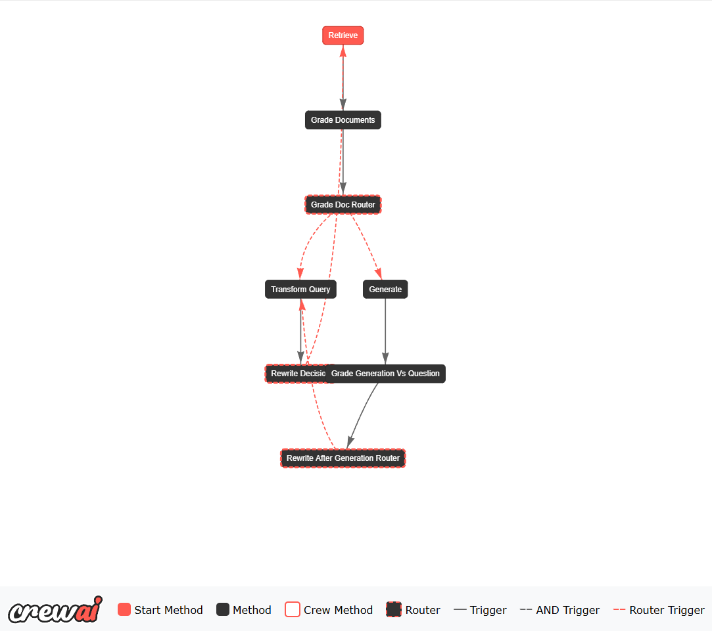

## 🧠 Self-RAG with CrewAI

This repository implements a **Self-RAG (Self-Reflective Retrieval-Augmented Generation)** architecture integrated with the **CrewAI** framework. It enables autonomous agents to retrieve external knowledge, generate responses, and evaluate the quality of information within a multi-step, LLM-powered reasoning flow.

## 📌 Overview

The architecture consists of specialized agents coordinated by a CrewAI flow, each responsible for a distinct stage of the process:

- Retriever Agent: Retrieves relevant information from an external knowledge base.

- Grader Agents: Evaluate the relevance of the retrieved documents and the generated answers based on a given question.

- Generator Agent: Generates an answer based on the retrieved external knowledge.

- Rewriter Agent: Rewrites the question if necessary.

- CrewAI Flow: Orchestrates communication and interaction between agents in a coordinated manner.

This approach aims to increase the system’s accuracy, coherence, and self-evaluation capabilities in complex, multi-step tasks.

## 🚀 Technologies Used

- Python
- CrewAI
- LangChain
- OpenAI
- Databricks Vector Search
- Pydantic

## 📸 Execution Flow



## 🧩 Step-by-Step Breakdown

```text
🔍 Retriever:
Fetches relevant documents to support the query.

🧠 Document Grader:
Evaluates and filters documents based on relevance.

🔀 Document Router:
Routes the flow depending on how many relevant documents were retrieved.

✍️ Generator:
Generates a response using filtered context.

🧠 Answer Grader:
Evaluates the answer's relevance, coherence, and completeness.

🔀 Answer Router:
Determines if the answer is ready or needs to go through revision.

♻️ Rewriter (optional):
Rewrites the original question if needed for better understanding or improved results.

✅ Final Answer:
Refined, validated response produced by the full reasoning pipeline.
